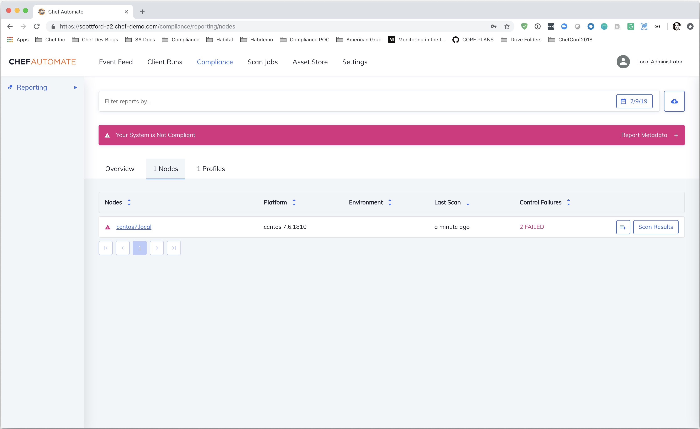
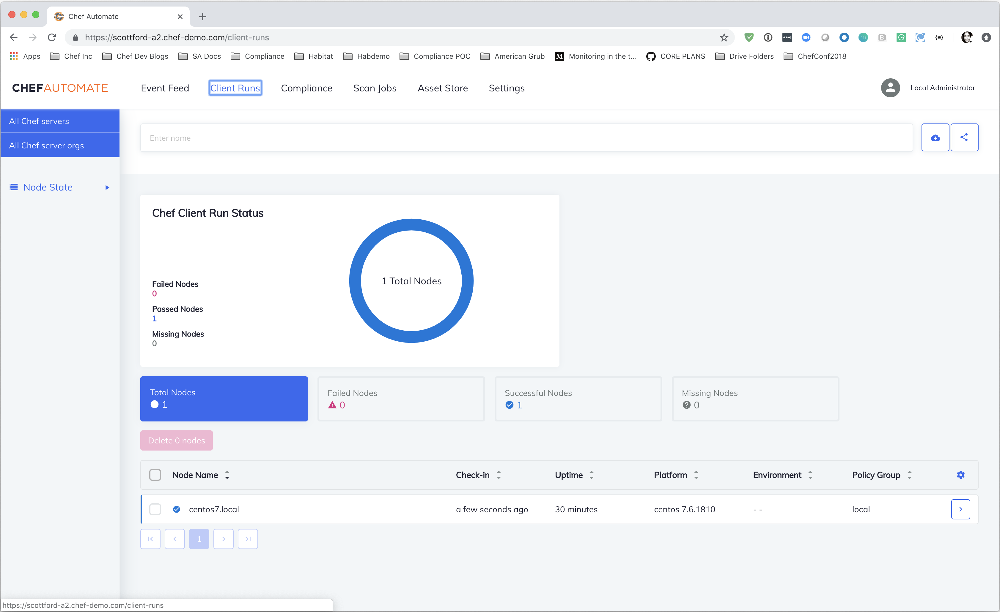
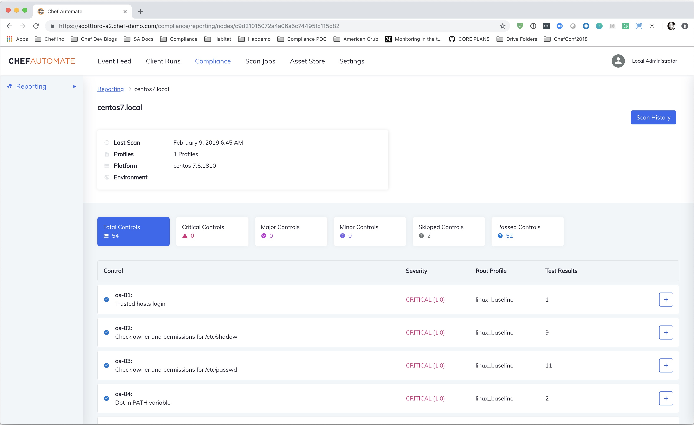

# Habitat Managed Demo

This repo is designed to provide a fast way to spin up a demo environment for demonstrating the business outcomes our target market can achieve with the Habitat Managed Chef and Habitat Managed Inspec patterns.

## Requirements

- [ChefDK or Chef Workstation](https://downloads.chef.io)
- [Terraform](https://terraform.io)
- [jq](https://stedolan.github.io/jq/)
- AWS Account in the Chef SA Organization (for SSL certificates)
- Automate 2 License

## Habitat Managed Inspec and Habitat Managed Chef

Before you begin you will need to build both a [Habitat Managed Inspec](https://github.com/chef/habitat_managed_inspec) and a [Habitat Managed Chef](https://github.com/chef/habitat_managed_chef) package for the platform you plan to demo. If you do not have a packages built you can spin this up by using the default origin of `chef-demo` which has packages already built for both Linux and Windows in the `stable` channel.

## Provision Automate 2

The terraform code in this repo allows you to provision a Chef Automate 2.0 instance in AWS, Azure, or GCP. The terraform code creates a DNS record for your automate instance.  The record is dynamically driven from variables in your `tfvars` file (i.e. `my-automate.chef-demo.com`). Additionally the code will create an application load balancer with a valid ssl certificate for your domain, which currently required for Habitat Managed Chef and Habitat Managed Inspec.

### AWS Considerations

This repo requires that a wild-card ACM certificat be pre-created and exist for consumption on the TLD of the A2 server.

### Azure Considerations

A DNS managed zone must exist in Azure DNS for provisioning to work properly.  This is controlled by settings in `variables.tf`.

### GCP Considerations

A DNS managed zone must exist in Google Cloud DNS for provisioning to work properly.  This is controlled by settings in `variables.tf`.

1. This repo includes a `terraform.tfvars.example` file. Copy that file to a new file called `terraform.tfvars` and update the values accordingly
2. Run `terraform init`
3. Run `terraform apply`

At the end of the `terraform` run you will see the credentials for your automate instance in the `STDOUT` as follows:

```bash
...
Apply complete! Resources: 11 added, 0 changed, 0 destroyed.

Outputs:

a2_admin = admin
a2_admin_password = 04f19f4b10bef9f5d530baefefe13dce
a2_token = apVi6pvZafjyz1og28DtDOOch5c=
a2_url = https://jmery-a2.gcp.chef-demo.com
chef_automate_public_ip = 35.185.226.203
chef_automate_url = https://jmery-a2.gcp.chef-demo.com
```

You will need those credentials to both login and update your Habitat Managed packages

## Habitat Managed Cookbook

The Habitat Managed Cookbook provides an easy way to provision instances on your local workstation that will check into the Chef Automate instance in the previous step for Habitat Managed Demos.

### Set Environment Variables

When your `terraform apply` has completed successfully, a file called `attributes.env` will have been created in the `cwd` where you ran `terraform apply`.  This `.env` file has been updated with the correct values for this new environment.

Run `source attributes.env` to add/update the required environment variables to your current shell.

### Demo

The Habitat Managed Cookbook provides a `recipes/default.rb` that will execute either the `linux.rb` or `windows.rb` recipes based off of the platform you are converging.

Inside the `recipes/linux.rb` you will see that lines 13-42 are commented out by default. This is intentional to allow you to walk the customer through the pattern of adding each package individually. On the first converge you will simply have habitat installed and running as a service in the background.

#### Kitchen converge

Run `kitchen converge centos-7` to bring up a linux box, install habitat and get the habitat supervisor running as a service...

```bash
$ kitchen login centos-7
Last login: Sat Feb  9 14:23:06 2019 from 10.0.2.2
[vagrant@centos7 ~]$ sudo su -
Last login: Sat Feb  9 14:23:08 UTC 2019 on pts/0
[root@centos7 ~]# hab sup status
No services loaded.
[root@centos7 ~]#
```

#### Build Habitat Managed Inspec

In a separate terminal, you now take the customer through building a Habitat Package that contains Inspec, your profiles, and the configuration to continuously monitor your system and report into Chef Automate. You can learn how to do that [here](https://github.com/chef/habitat_managed_inspec)

Once you have `<your_origin>/linux_baseline` built, pushed to the depot, and promoted to stable, you can update the `linux.rb` recipe and uncomment lines 13-26 and run another `kitchen converge centos-7` to load the package and validate the system. After converging you can show the service now running:

```bash
[root@centos7 ~]# hab svc status
package                                        type        desired  state  elapsed (s)  pid   group
scottford/linux_baseline/0.1.0/20190207202443  standalone  up       up     6            4113  linux_baseline.default
```

Now you can login to Chef Automate and view the results of the scan...


#### Build Habitat Managed Chef

In a separate terminal, you can take the customer through building a Habitat Managed Chef package that contains the `chef-client`, cookbooks, a policyfile, and the configuration to continuously run `chef-client` on a schedule and report to Chef Automate. You can learn how to do that [here](https://github.com/chef/habitat_managed_chef)

Once you have `<your_origin>/chef-base` built, pushed to the depot, and promoted to stable, you can update the `linux.rb` recipe and uncomment lines 28-42 and run another `kitchen converge centos-7` to load the package and validate the system. After converging you can show the service now running:

```bash
[root@centos7 ~]# hab svc status
package                                        type        desired  state  elapsed (s)  pid   group
scottford/chef-base/0.1.0/20190207204158       standalone  up       up     3            9919  chef-base.default
scottford/linux_baseline/0.1.0/20190207202443  standalone  up       up     818          4113  linux_baseline.default
[root@centos7 ~]# journalctl -fu hab-sup
-- Logs begin at Sat 2019-02-09 14:15:07 UTC. --
Feb 09 14:44:54 centos7.local hab[3683]: chef-base.default(O):
Feb 09 14:44:54 centos7.local hab[3683]: chef-base.default(O): Running handlers:
Feb 09 14:44:54 centos7.local hab[3683]: chef-base.default(O): Running handlers complete
Feb 09 14:44:54 centos7.local hab[3683]: chef-base.default(O):
Feb 09 14:44:54 centos7.local hab[3683]: chef-base.default(O): Deprecated features used!
Feb 09 14:44:54 centos7.local hab[3683]: chef-base.default(O):   Resource sysctl_param from a cookbook is overriding the resource from the client. Please upgrade your cookbook or remove the cookbook from your run_list before the next major release of Chef. at 1 location:
Feb 09 14:44:54 centos7.local hab[3683]: chef-base.default(O):     - /hab/pkgs/chef/chef-client/14.10.9/20190129215404/chef/lib/chef/log.rb:51:in `caller_location'
Feb 09 14:44:54 centos7.local hab[3683]: chef-base.default(O):    See https://docs.chef.io/deprecations_map_collision.html for further details.
Feb 09 14:44:54 centos7.local hab[3683]: chef-base.default(O):
Feb 09 14:44:54 centos7.local hab[3683]: chef-base.default(O): Chef Client finished, 3/88 resources updated in 05 seconds
Feb 09 14:44:56 centos7.local hab[3683]: linux_baseline.default(O): InSpec run did not complete successfully. If you do not see any errors above,
Feb 09 14:44:56 centos7.local hab[3683]: linux_baseline.default(O): control failures were detected. Check the InSpec results here for details:
Feb 09 14:44:56 centos7.local hab[3683]: linux_baseline.default(O): Otherwise, troubleshoot any errors shown above.
Feb 09 14:44:56 centos7.local hab[3683]: linux_baseline.default(O): sleeping for 30 seconds
```

With that you can login to the Automate UI again and show the converged node and the results of the compliance scan after running Chef:



## Tear down the environment

After your demo you can tear down your environment;

```bash
scottford$ kitchen destroy
-----> Starting Kitchen (v1.24.0)
WARN: Unresolved specs during Gem::Specification.reset:
      bundler (>= 1.10)
WARN: Clearing out unresolved specs.
Please report a bug if this causes problems.
-----> Destroying <habitat-managed-centos-7>...
       ==> default: Forcing shutdown of VM...
       ==> default: Destroying VM and associated drives...
       Vagrant instance <habitat-managed-centos-7> destroyed.
       Finished destroying <habitat-managed-centos-7> (0m4.56s).
-----> Destroying <habitat-managed-windows-2016>...
       Finished destroying <habitat-managed-windows-2016> (0m0.00s).
-----> Destroying <habitat-managed-windows-2012r2>...
       Finished destroying <habitat-managed-windows-2012r2> (0m0.00s).
-----> Kitchen is finished. (0m11.26s)
~/src/habitat_managed_demo/habitat_managed_cookbook (master)
scottford$ cd ../terraform/aws/
~/src/habitat_managed_demo/terraform/aws (master)
scottford$ terraform destroy
random_id.instance_id: Refreshing state... (ID: y8h0Aw)
data.template_file.install_chef_automate_cli: Refreshing state...
aws_vpc.habmgmt-vpc: Refreshing state... (ID: vpc-0d1dc85af12d41cef)
data.aws_route53_zone.selected: Refreshing state...
data.aws_acm_certificate.chef_automate: Refreshing state...
```
=======
# driving-compliance-roadtrip
>>>>>>> 66d199c003f122331b3c82ca925a34ac36c872ec
